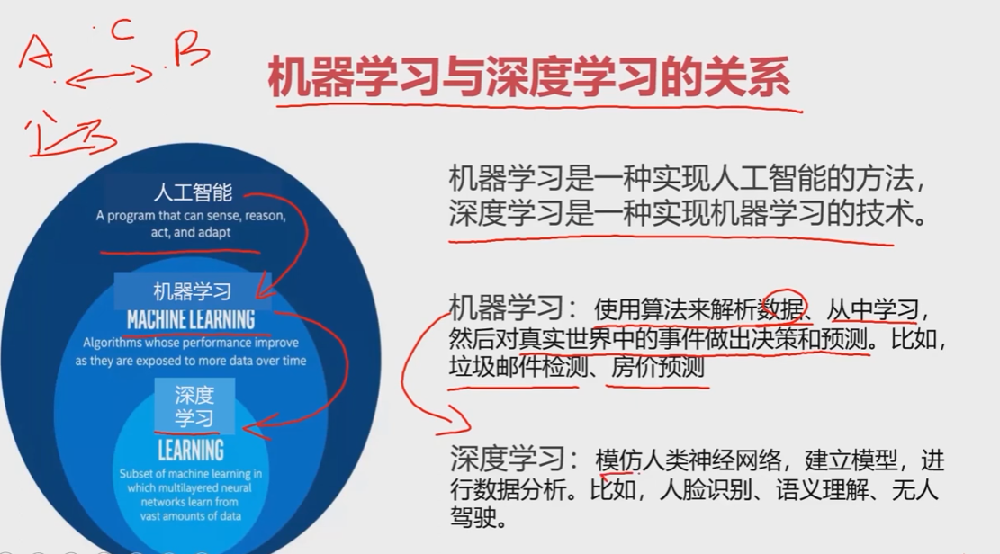
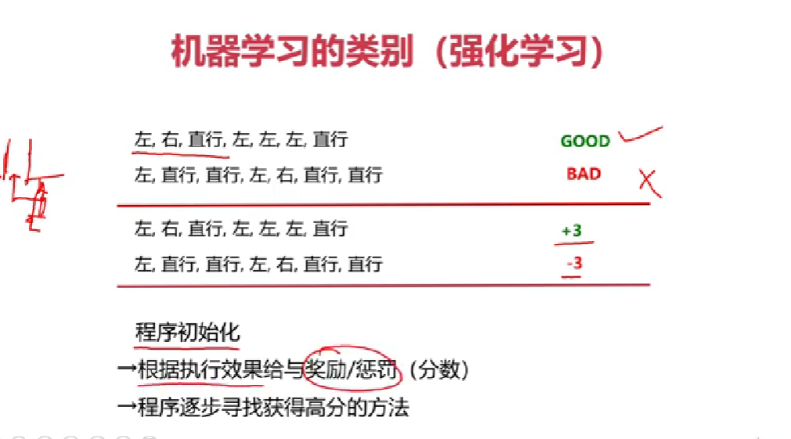
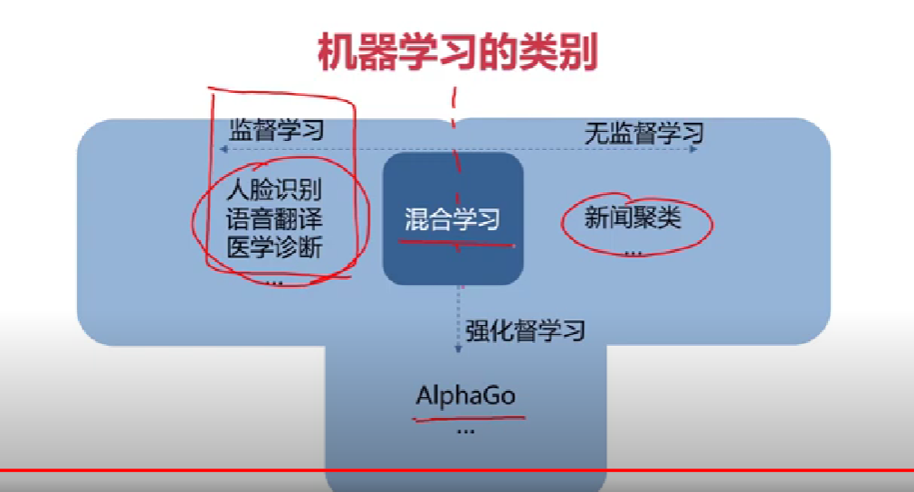
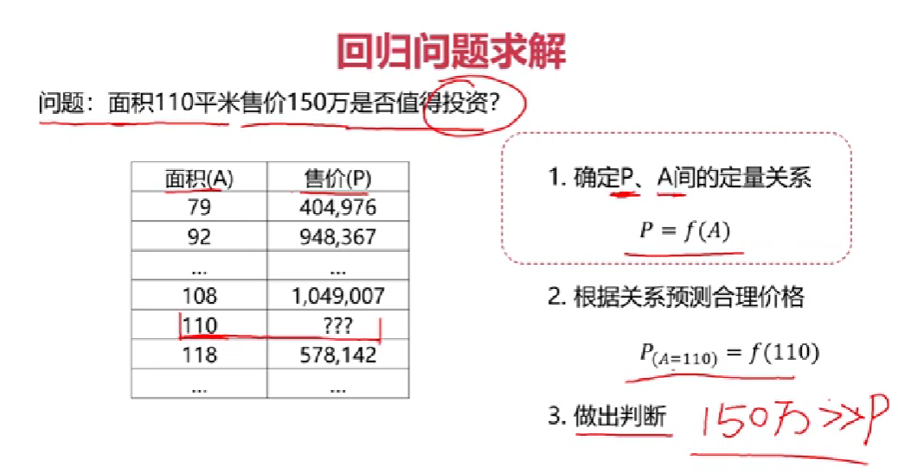
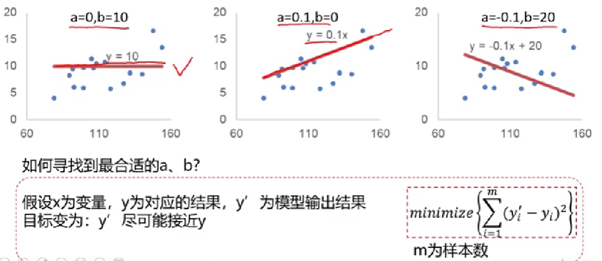
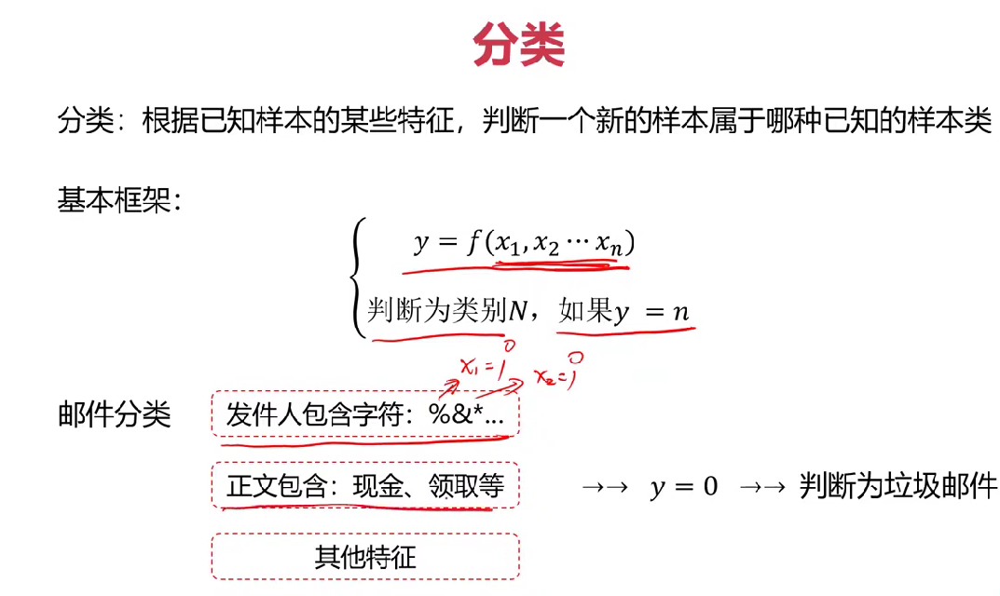
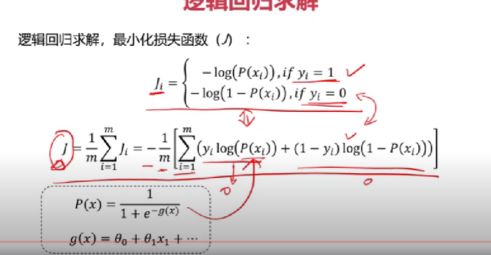

python exercise 
使用SQLModel，基于pydantic and SQLAlchemy的简单 健壮和兼容性的ORMapping。
database使用Mariadb
SQLModel 支持同步和异步 两种操作模式


# Start with Artificial Intelligence from Zero(从零入门人工智能)

1. 课程介绍及环境配置
2. 机器学习之线性回归
3. 机器学习之逻辑回归
4. 机器学习之聚类
5. 机器学习其他常用技术
6. 模型评价与优化
7. 深度学习之多层感知器
8. 深度学习之卷积神经网络
9. 深度学习之循环神经网络
10. 迁移混合模型及课程总结


pandas 

matplotlib

numpy

1 什么是AI

- 车牌识别，人脸识别，自动驾驶

- 情感分类，机器翻译，人机互动
- 智能机器人，AlphaGO

定义：人工智能亦称机器智能，指由人制造出来的机器所表现出来的智能。

其核心问题包括构建能够跟人类似甚至超卓的推理、知识 、规划、学习、交流、感知、移物、使用工具和操控机械的能力等。

Intelligence: 自主学习及解决问题的能力

Artifical Intelligence:机器对人类智能的模仿。


根据输入信息进行模型结构、权重更新，实现最终优化。特点：信息处理、自我学习、优化升级。

**符号学习**：基于逻辑与规则的学习方法。 专家系统，DeepBlue 下国际象棋

**机器学习**：从数据中寻找规律，建立关系，根据建立的关系去解决问题的方法。

机器学习与深度学习关系：




AI开发工具和环境：

Python/Anaconda/Jupyter notebook/

基础工具包：

Panda、强大的分析结构化数据的工具集，实现数据快速导入导出

Numpy、进行科学计算的基础软件包。基于N维数组对象ndarray的数组计算。

Matplotlib 基础绘图库

------


scikit learn

线性回归：

回归分析 、线性回归模型及核心原理，代码实践

逻辑回归：解决分类问题

分类模型框架，逻辑回归分析，核心原理

无监督式学习：聚类 

聚类分析、K均值聚类、KMeans VS KNN

其他技术：

决策树、异常数据检测、数据降维、主成分分析（PCA）

iris数据集。 

模型评价与优化：

模型选择： KNN 、MLP 、 Decision Tree 、Logistic Regression

核心参数优化：

数据预数据：

混淆矩阵：

过拟合与欠拟合：

代码实战：


chapter 7 机器学习转入深度学习

逻辑回归的局限性  ：Keras工具包

多层感知器MLP

MLP实现非线性分类 和多分类


 8 卷积神经网络：图像处理

普通MLP的局限性

图像卷积运算：提取图像轮廓

卷积神经网络。

经典CNN模型

9 循环神经网络

序列数据模型

循环神经网络

不同类型的RNN

长短期记忆网络LSTM、 股份预测 。文本生成

10 迁移混合模型

迁移学习

监督+无监督学习

机器学习+深度学习。

案例：异常苹果检测 

​            PVC


#### 机器学习的分类：

- 监督学习Supervised Learning :训练数据包括正确的结果,label
- 无监督学习 Unsupervised Learning:训练数据不包括正确的结果
- 半监督学习 Semi-supervised Learning：训练数据包括少量正确的结果。
- 强化学习 Reinforcement Learning：根据每次结果收获的奖惩feedback进行学习，实现优化







#### 机器学习之线性回归

回归分析：根据数据，确定两种或两种以上变量间相互依赖的定量关系。

​	$y=f(x_1,x_2,...x_n)$

- 百万人口医生数量预测区域人均寿命
- 年龄预测身高
- 住宅面积预测售价

回归分类:

-  变量数: 一元回归,多元回归 
- 函数关系:线性回归,非线性回归

​                房价=f(面积) 


线性回归:在回归分析中变量与因量存在线性关系移为线性回归.

回归问题求解?







损失函数尽可能小.


##### 梯度下降法:


##### scikit-learn

python中专门针对机器学习的一款开源框架算法库,可实现数据预处理、分类、回归、降维、模型选择等常用机器学习算法。

特点：

不支持python外的语言，不支持深度学习和强化学习。


##### 逻辑回归

实例：垃圾邮件检测：输入电子邮件，输出是垃圾邮件/普通邮件

流程:

- 标注样本邮件为垃圾邮件/普通邮件
- 获取批量的样本邮件及其标签,学习其特征
- 针对新邮件,自动判断其类别

特征:

用于帮助判断 是否为垃圾邮件的属性

- 发件人包含字符 %&\*
- 正文包含现金领取等
- ...


实例:图像分类

输入:图像

打标签 tag (人手工)

计算机学习图像的形状,分布

实例:数字识别/考试通过预测


分类:根据样本的某些特征,判断一个新样本属于哪个已知的样本类.




分类方法:

- 逻辑回归
- KNN近邻模型
- 决策树
- 神经网络

分类任务:

根据余额,判断小明是否会去看电影.

样本量变大以后,准确率下降.

逻辑回归方程:$Y=\frac{1}{1+e^{-x}}$

==>
$$
y=f(x)=\begin{cases} 
1,& \text Y\geq0.5 \\
0,& \text Y<0.5
\end{cases}
$$
用于解决分类问题的一种模型,根据数据特征或属性,计算其归属于某一类别的概率P(x),根据概率数值判断其所属类别.主要应用场景:二分类问题.是或不是

y为类别结果,x为特征值.P为概率分布.

当分类任务变得更为复杂,比如增加多个维度D.逻辑回归表现如何?

在多个维度间增加一条边界,称为决策边界(Decision Boundary).

逻辑回归结合多项式边界函数可解决复杂的分类问题.

##### 逻辑回归求解

根据训练样本,寻找类别边界
$$
P(x)=\frac{1}{1+e^{-g(x)}} \\
g(x)=\theta_0+\theta_1x_1+\theta_2x_2+\cdots
$$
根据训练样本,寻找$\theta_0,\theta_1,\theta_2$


线性回归求解，最小化损失函数


分类问题，标签与预测的结果都是离散点，使用该损失函数无法寻找极小值点。

逻辑回归求解，最小化损失函数




##### 逻辑回归实战

- 分类散点图可视化

    ​	  区分类别散点图：

       ```python
       mask=y==1
       passed=plt.scatter(X1[mask],X2[mask])
       failed=plt.scatter(X1[~mask],X2[~mask],makert='^')
       ```

    1. 模型训练
    2. 获得边界函数系数
    3. 对新数据做预测
    4. 生成新的属性数据

- 逻辑回归模型使用

- 建立新数据集

- 模型评估

       通过准确率判断模型好坏，准确率越接近1越好。

    计算准确率： 复用sklearn函数，画图看决策边界效果，可视化模型表现：

###### 实战一：考试通过预测

step1:基于examdata.csv数据，建立逻辑回归模型，评估模型表现。

step2:预测exam1=75,exam2=60时，exam3该同学是否能通过

step3:建立二阶边界函数，重复step1,step2


###### 实战二：
